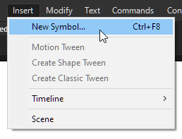
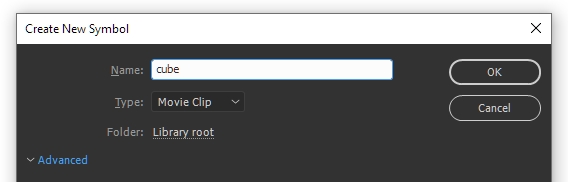
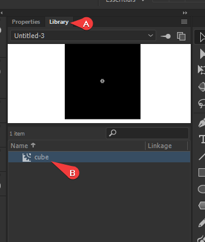
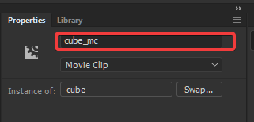

## Langkah
1. Buka Flash lalu buatlah dokumen ActionScript 3.0 baru.
2. Buatlah sebuah objek Movie Clip dengan cara klik Insert -> New Symbol.



3. Atur namanya sesuka hati anda dengan tipe Movie Clip, dalam hal ini saya akan menamainya `cube`. Setelah itu tekan OK.



4. Buatlah bentuk objek yang anda ingin gerakkan. Objek ini bisa berupa shape biasa atau gambar bitmap seperti mobil dll.
5. Setelah selesai, kembali ke stage utama.
6. Tarik movie clip tadi ke dalam stage pada tab Library.
   


7. Buka tab Properties lalu ganti instance namenya dengan format `NAMAOBJEK_mc`. Contohnya `cube_mc`



8. Tekan F9 untuk membuka window Actions
9. Ketik kode dibawah ini

```as
import flash.events.KeyboardEvent;

// Membuat Keyboard event listener pada stage serta memanggil function moveObj
stage.addEventListener(KeyboardEvent.KEY_DOWN, moveObj);

function moveObj(e: KeyboardEvent): void {
	// Mendeklarasikan tombol yang akan dipakai
	const right = Keyboard.RIGHT;
	const left = Keyboard.LEFT;
	const up = Keyboard.UP;
	const down = Keyboard.DOWN;
	
	// GANTI DENGAN INSTANCE NAME YANG TELAH DIBUAT PADA LANGKAH KE 7
	// Mendeklarasikan objek yang akan digerakan
	const object = cube_mc; 
	
	// Mendeklarasikan variabel kecepatannya
	var speed:int = 10;

	// Jalankan kondisi Switch nya
	switch (e.keyCode) {
		case right:
			{
				object.x += speed;
				break;
			}
		case left:
			{
				object.x -= speed;
				break;
			}
		case up:
			{
				object.y -= speed;
				break;
			}
		case down:
			{
				object.y += speed;
				break;
			}
	}
}
```
10. Lalu jalankan dengan cara tekan tombol Ctrl-Enter

## Sumber
- https://help.adobe.com/en_US/FlashPlatform/reference/actionscript/3/flash/events/KeyboardEvent.html
- http://pixelstreetstudios.com/flash/flash-cs4-actionscript-3-0-topics/keyboard-press-move-object/
